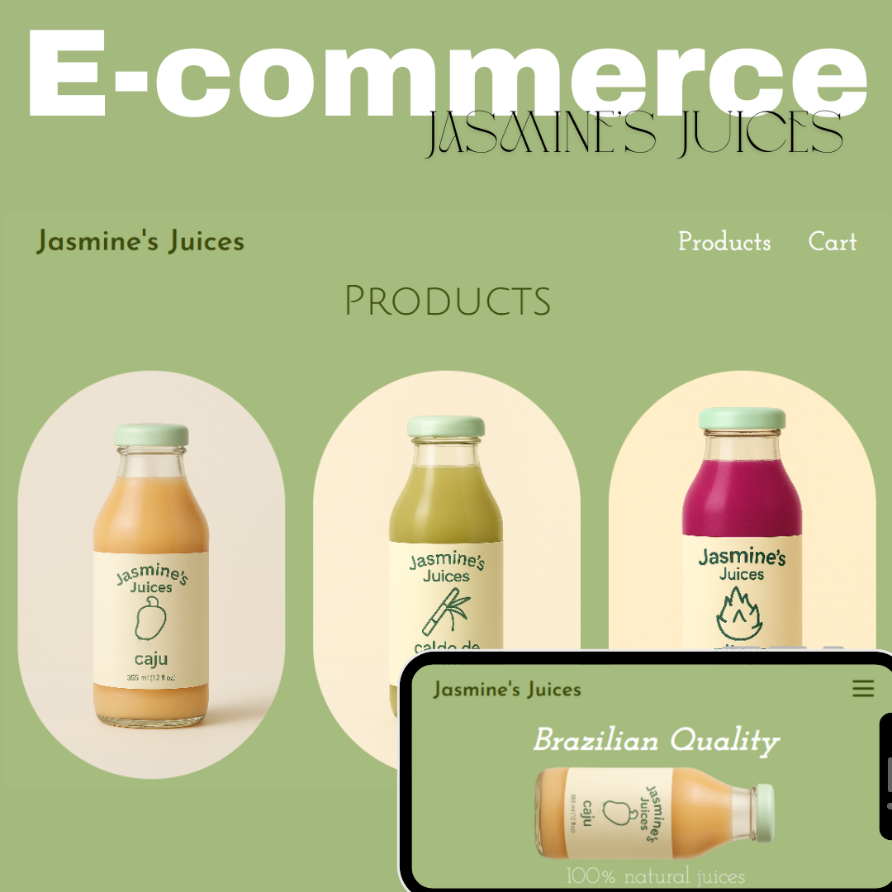

<h1 align="center">🧃 Jasmine's Juices - E-commerce</h1>

## 📲 Acesse / Access

**Contatos / Contacts:**

- [LinkedIn](https://linkedin.com/in/marianabelo26/)
- [Instagram](https://instagram.com/marianabelo.__)
- [Portfólio Web (live)](https://marianabelo26.github.io/siteApple/)

---

## 💻 Projeto / Project

### 🖥️ [Jasmine's Juice](https://jasminesjuice.netlify.app/)

  

Uma landing page responsiva de e-commerce para uma marca de sucos naturais, feita com Next.js e Tailwind CSS.

A responsive e-commerce landing page for a natural juice brand, built with Next.js and Tailwind CSS.

---  

## 🚀 Tecnologias / Tech Stack

- HTML5
- CSS3
- React
- Next
- TypeScript
- JavaScript
- Tailwind CSS
- Git & GitHub
- Netlify (Deploy)

---

## 📷 Preview

  

---

## 🤝 Conecte-se / Let's connect!

Sinta-se à vontade para me chamar em qualquer rede para conversarmos sobre projetos, freelas ou oportunidades de trabalho.

Feel free to reach out to me on any platform to talk about projects, freelancing, or job opportunities.

---

## 🪪 Autor / Author

**Mariana Belo**  
🌍 Front-end Developer  
📍 Teixeira de Freitas, BA – Brazil  
📧 marianabelo.dev@gmail.com

---
